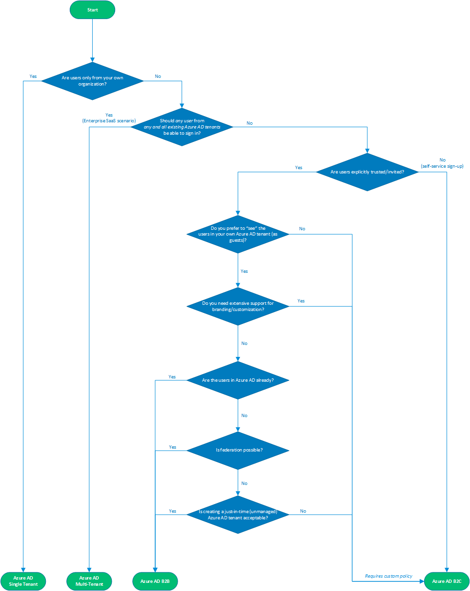

# Azure Active Directory External Identities Decision Tree

## Introduction

There are a number of flavors of Azure Active Directory (Azure AD) that allow you to work with "external identities", i.e. users that are outside of your own organization:

- [Azure AD](https://docs.microsoft.com/azure/active-directory/) (sometimes also referred to as Azure AD B2E - Business to Enterprise)
  - When writing applications for Azure AD, you can target users from a single organization (single tenant), or users from any organization that already has an Azure AD tenant (called [multi-tenant applications](https://docs.microsoft.com/azure/active-directory/develop/howto-convert-app-to-be-multi-tenant)).
- [Azure AD B2B](https://docs.microsoft.com/azure/active-directory/b2b/) (Business to Business)
  - This isn't so much a different directory service, it's an extension on top of Azure AD that allows you to work with external identities, mainly for collaboration scenarios using Microsoft applications (e.g. Office 365, Microsoft Teams, PowerBI, ...).
  - In Azure AD B2B, you invite external users into your own tenant as "guest" users that you can then assign permissions to (for _authorization_) while still allowing them to keep using their existing credentials (for _authentication_) inside their own organization.
- [Azure AD B2C](https://docs.microsoft.com/azure/active-directory-b2c/) (Business to Consumer, Customer or even Citizen)
  - This is a separate directory service (but still built on top of the global Azure AD infrastructure) which enables you to customize and control how customers sign up, sign in, and manage their profiles when using your applications.

In order to choose the right Azure AD flavor for your project, there are a number of decision factors that come into play. This document provides a decision tree and guidance to help you make the right choice.

## Decision Tree

Here are some additional considerations for a few of these decision points:

- _"Should any user from any and all existing Azure AD tenants be able to sign in?"_ covers the scenario where all three of the following conditions are met:
  - The users will be defined in a regular Azure AD tenant (not in Azure AD B2C) or have a personal Microsoft Account.
  - The Azure AD tenants that contain the users already exist.
  - You accept users to sign in from _any_ existing Azure AD tenant (in practice you can of course still reject users inside the application itself depending on the tenant that they signed in through, e.g. if you only want to allow users from specifically allowed tenants).
- _"Do you prefer to 'see' the users in your own Azure AD tenant (as guests)?"_
  - This is an important decision factor to check if Azure AD B2B is suitable for your scenario because B2B users are represented as [guest users](https://docs.microsoft.com/azure/active-directory/b2b/user-properties) _inside your own Azure AD tenant_.
  - This has implications around trust and security, e.g. guest users can be browsed in your directory and granted permissions to your resources (e.g. SharePoint documents, Outlook calendars, PowerBI dashboards, even your Azure subscriptions).
  - Guest users are also able to get information about users in _your_ directory (which they are now a guest of), and depending on the [permissions you've granted these guest users](https://docs.microsoft.com/azure/active-directory/fundamentals/users-default-permissions) they can also browse users and groups, see application definitions and more.
  - This may be exactly what you want in a situation where you trust these users to collaborate with your organization (e.g. business partners or vendors); it may also be something you explicitly want to avoid (e.g. to prevent someone from inadvertently or maliciously granting these guest users permissions to corporate resources or your Azure subscriptions).
  - Think of it this way: _would you invite these users into your physical office building?_ If so, then B2B guest user access may be a great choice.
- _"Do you need extensive support for branding/customization?"_
  - Azure AD (and by extension, Azure AD B2B) allow for [branding of the sign-in page](https://docs.microsoft.com/azure/active-directory/fundamentals/customize-branding), but this is more limited than what Azure AD B2C offers.
  - For now, fully [customized user experiences](https://docs.microsoft.com/azure/active-directory-b2c/customize-ui-overview) can only be achieved in Azure AD B2C.
- _"Is creating a just-in-time (unmanaged) Azure AD tenant acceptable?"_
  - This refers to the Azure AD capability where users can perform a [self-service signup in Azure AD](https://docs.microsoft.com/azure/active-directory/users-groups-roles/directory-self-service-signup) with their email address and an Azure AD tenant corresponding to their email domain will automatically and transparently be created for them behind the scenes (a so-called _unmanaged_ or _just-in-time_ directory, sometimes also referred to as a _viral_ tenant).
  - Note that customers can still [take control of this unmanaged directory](https://docs.microsoft.com/azure/active-directory/users-groups-roles/domains-admin-takeover), but depending on your user base having this directory created for them may or may not be acceptable.

> **NOTE**: This decision tree is intended as a starting point to understand your options, but there can be others or even combinations of different options. For example, you can use Azure AD B2C and configure it to [allow user sign-in for multi-tenant Azure AD tenants](https://docs.microsoft.com/azure/active-directory-b2c/active-directory-b2c-setup-commonaad-custom) - with or without the traditional support for self-service sign up and social identity providers.

## Examples

### Line-Of-Business (LOB) App

Imagine you are building a Line-Of-Business application to track expenses for the employees of your organization. As the intended audience is _all users of your own organization_, **Azure AD with a single tenant** (i.e. yours) is likely the best choice.

### Collaboration App

Imagine in the previous example that you also work with external users (e.g. vendors) who need to submit expenses. You _could_ create identities for them directly in your own Azure AD tenant, but then you become responsible for managing those identities (i.e. their user lifecycle and credentials), and they have another identity to remember (which also means they lose Single Sign On with their existing systems for example).

In this scenario, using **Azure AD B2B** is likely the best option. You can explicitly [invite the people you collaborate with](https://docs.microsoft.com/azure/active-directory/b2b/add-users-administrator) so they get added as guest users to your tenant, and you can give them access to the same applications that your own organization's users are using (including the expense application you've built yourself).

### Enterprise Software-as-a-Service (SaaS) App

Now imagine you are building a platform for tracking expenses that _other_ organizations can use (e.g. through a subscription model for a monthly fee). In that case, you're not tracking expenses _for your own employees_, but providing a service that external organizations can onboard onto so that _their users_ can sign in to your application.

You now have a choice to make:

- You can define your target audience as _all organizations that have Azure AD_ today (i.e. have a total addressable market of over a billion users across millions of organizations). In this case you can easily create an **Azure AD multi-tenant application** and join the [marketplace with thousands of other SaaS vendors](https://azuremarketplace.microsoft.com/marketplace/apps/category/azure-active-directory-apps).
- You can also choose to target any user or organization that does not necessarily have an Azure AD tenant. In that case, it depends on your business model if you want to allow anyone to sign up freely and try out your service, or if you want to restrict your users to only explicitly invited people. In both cases, you probably don't want to see these users as guests in your own Azure AD tenant. **Azure AD B2C** is well suited to handle this scenario, possibly with custom policies to restrict who can sign up for an account.
- Finally as a combination of both previous methods, you can also use **Azure AD B2C** and configure it to [allow user sign-in for multi-tenant Azure AD tenants](https://docs.microsoft.com/azure/active-directory-b2c/active-directory-b2c-setup-commonaad-custom) - with or without the traditional support for self-service sign up and social identity providers.

### Commerce App

Imagine you are building a web shop which allows anyone to sign up, perhaps with a username and password they choose specifically for your application, or by reusing a social identity they already have (e.g. a Microsoft Account, Facebook, Twitter, ...).

In this case, **Azure AD B2C** is probably the best choice as it allows you to define [user flows](https://docs.microsoft.com/azure/active-directory-b2c/tutorial-create-user-flows) in a completely branded experience where your end users won't even notice that the sign-in is handled outside of your application.

Even if you want _your own organization's users_ to access the same applications with their existing credentials (e.g. for handling back-office operations inside the same web shop application), you can set up [federation towards your own Azure AD tenant](https://docs.microsoft.com/azure/active-directory-b2c/active-directory-b2c-setup-oidc-azure-active-directory) and allow your users to sign in separately from your end customers.

Azure AD B2C provides a lot of additional flexibility when it comes to [federating with other identity providers](https://docs.microsoft.com/azure/active-directory-b2c/tutorial-add-identity-providers), [customizing the user experience](https://docs.microsoft.com/azure/active-directory-b2c/customize-ui-overview), [managing user access](https://docs.microsoft.com/azure/active-directory-b2c/manage-user-access) (e.g. for GDPR compliance) and even defining [custom policies](https://docs.microsoft.com/azure/active-directory-b2c/active-directory-b2c-overview-custom) to support advanced scenarios.

## Feature Support

The table below details which features are available in the different flavors of Azure AD (or which nuances there are between them), which can help the decision making.

| Feature                                                                                                                                           | Azure AD Single Tenant | Azure AD Multi-Tenant | Azure AD B2B | Azure AD B2C |
| ------------------------------------------------------------------------------------------------------------------------------------------------- | ---------------------- | --------------------- | ------------ | ------------ |
| Is primarily intended for Line-Of-Business (LOB) applications                                                                                     | Yes                    | No                    | No           | No           |
| Is primarily intended for Enterprise Software-as-a-Service (SaaS) applications                                                                    | No                     | Yes                   | No           | No           |
| Is primarily intended for collaboration using Microsoft applications (O365, Teams, ...)                                                           | No                     | No                    | Yes          | No           |
| Is primarily intended for transactional services using custom developed applications                                                              | No                     | No                    | No           | Yes          |
| Supports Azure AD users (from a single tenant)                                                                                                    | Yes                    | Yes                   | Yes          | Yes [1]      |
| Supports Azure AD users (from multiple tenants)                                                                                                   | No                     | Yes [2]               | Yes [3]      | Yes [4]      |
| Supports federation to business partners in existing Azure AD tenants                                                                             | No                     | Yes                   | Yes          | Yes          |
| Supports federation to (potentially many) business partners in non-existing Azure AD tenants (creating an ad-hoc "unmanaged" tenant)              | No                     | No [5]                | Yes [6]      | No [5]       |
| Supports federation to Microsoft Accounts                                                                                                         | No                     | No                    | Yes          | Yes          |
| Supports federation to Google Accounts                                                                                                            | No                     | No                    | Yes [7]      | Yes          |
| Supports federation to any SAML or WS-Federation Identity Provider                                                                                | No                     | No                    | Yes [8]      | Yes [9]      |
| Supports federation to other social accounts (Facebook, Twitter etc)                                                                              | No                     | No                    | Yes [10]     | Yes          |
| Can *easily* pre-approve/invite users                                                                                                             | No                     | No                    | Yes [3]      | No [9]       |
| Can *easily* handle delegated user management, where the external organization can manage their users that should have access to your application | No                     | Yes [11]              | Yes [12]     | No [13]      |

Notes:

- [1]: [Set up the Azure AD tenant as an Identity Provider using OpenID Connect](https://docs.microsoft.com/azure/active-directory-b2c/active-directory-b2c-setup-oidc-azure-active-directory).
- [2]: Develop your application using [the "common" endpoint](https://docs.microsoft.com/azure/active-directory/develop/howto-convert-app-to-be-multi-tenant#update-your-code-to-send-requests-to-common).
- [3]: [Invite them as B2B guest users](https://docs.microsoft.com/azure/active-directory/b2b/add-users-administrator).
- [4]: [Set up the other tenants as Identity Provider using OpenID Connect](https://docs.microsoft.com/azure/active-directory-b2c/active-directory-b2c-setup-oidc-azure-active-directory); optionally allow users from _any_ tenant using [the "common" endpoint](https://docs.microsoft.com/azure/active-directory/develop/howto-convert-app-to-be-multi-tenant#update-your-code-to-send-requests-to-common).
- [5]: The Azure AD tenants must already exist.
- [6]: Note that you can even automate the creation of users and "unmanaged" tenants.
- [7]: See [Google Federation in Azure AD B2B](https://docs.microsoft.com/azure/active-directory/b2b/google-federation).
- [8]: Azure AD B2B supports [direct federation](https://docs.microsoft.com/azure/active-directory/b2b/direct-federation) using SAML and WS-Federation.
- [9]: This can be achieved by using [Azure AD B2C custom policies](https://docs.microsoft.com/azure/active-directory-b2c/active-directory-b2c-overview-custom).
- [10]: Azure AD B2B is soon to support using [One-Time Passcodes](https://docs.microsoft.com/azure/active-directory/b2b/one-time-passcode) with _any_ email address.
- [11]: The external Azure AD tenants are managed by their respective owning organizations.
- [12]: The B2B guest users are managed in their home tenants.
- [13]: There is no additional user "grouping" for delegated user management; you have to build your own user management experience on top of Azure AD B2C using the Graph API.
