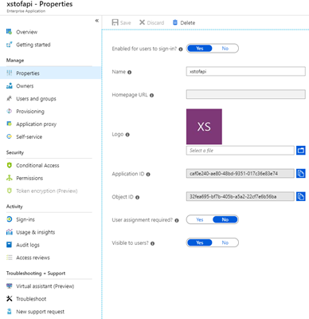

# Scenario: Service to Service Authentication using Access Tokens

## Introduction

This scenario describes how one would like to protect a web API or service to only accept calls from trusted parties.  Typically this is applicable when an Azure web app would like to make sure it cannot be called by other clients than the one it explicitly trusts.  When using a regular non-ASE frontend web app as a client it is hard to lock down the API which it calls to just that frontend.  The reason for this is that the outbound set of ip's used by the frontend web app is also shared by other customers and cannot be considered static.  With the support for "[Service Endpoints](https://docs.microsoft.com/en-us/azure/virtual-network/virtual-network-service-endpoints-overview)" and the "[new vnet integration](https://docs.microsoft.com/en-us/azure/app-service/web-sites-integrate-with-vnet#new-vnet-integration)", such lockdown can now also be done on the networking level although even there are limitations at the time of writing (two different web apps in the same app service plan can only connect into the same subnet, not different ones).

In the following scenario, securing the traffic between the client and the web API is done on application level, using OAuth2 access tokens which are flowing from the client to the web API and which have been obtained from Azure Active Directory using a so-called "[client credential flow](https://docs.microsoft.com/en-us/azure/active-directory/develop/v2-oauth2-client-creds-grant-flow)".

> Note that there is a similar flow called the "on-behalf-of" flow, which also allows an application to acquire a token (by presenting another token), but instead of that token representing the application itself, it would represent the user who called into the application in the first place.  This flow is not considered in this article.

## Overview

In this scenario there are two parties at play:
- the client which calls the API, which we'd call the _daemon_ 
- the API itself, which we'll just call _API_

### Register all parties in Azure Active Directory

- **register apps**: each of the parties needs to be represented in Azure Active Directory [by _registering_ them](https://docs.microsoft.com/en-us/azure/active-directory/develop/quickstart-register-app).
- **assign client creds**: when each registration has been done, make sure to assign client credentials to the daemon application which it can later use to proof its identity towards AAD.
- **advertise role on API**: now, modify the registration manifest for the API, to [advertise at least one role](https://docs.microsoft.com/en-us/azure/active-directory/develop/howto-add-app-roles-in-azure-ad-apps).

For example, we could add two roles to our manifest: one that allows reading and one that allows writing:

~~~json
"appRoles": [
    {
        "allowedMemberTypes": ["Application"],
        "description": "Applications can write",
        "displayName": "WriteRole",
        "id": "830ff8d7-d136-45c1-b931-67eca5f458cf",
        "isEnabled": true,
        "lang": null,
        "origin": "Application",
        "value": "writerole"
    },
    {
        "allowedMemberTypes": ["Application"],
        "description": "Applications can read",
        "displayName": "ReadRole",
        "id": "751d2252-59ce-4c8a-ac83-3c5246428fd4",
        "isEnabled": true,
        "lang": null,
        "origin": "Application",
        "value": "readrole"
    }
]
~~~

(_Note that these `id` values must be newley generated GUIDs to guarantee uniqueness._)

At this point, technically, the daemon app can request a token for accessing the API.  In that token, the role would not show up as the daemon was not assigned to the role yet.  This also goes for _any other app_ in your Azure Active Directory tenant: when your application registration has not been locked down by setting the "User Assignment Required?" flag to "Yes" within the properties of the corresponding Service Principal, then anyone (user or application) is able to fetch a token with the API as the audience.  

There are two ways to prevent this from happening, which can be combined if desired:
1) make sure to set this flag to "Yes" by [updating the app to enable user assignment](https://docs.microsoft.com/en-us/azure/active-directory/develop/howto-restrict-your-app-to-a-set-of-users#update-the-app-to-enable-user-assignment)
2) make sure to check for a role in the token within the application logic of the web API: the appearance of a role in the token means that explicit permissions was given to a user or application to access the API under that role

### Configure daemon app to request access to the API

To prevent any random application or user from requesting a token towards the web API, we configured the web API registration manifest to advertise a role.  Now, we still need to make sure our daemon app requests access to the web API under this role _and_ is granted that request by an administrator.

- Request access to the role: go to the daemon application registration and open the "API permissions" blade where you can [Add permissions to access web API](https://docs.microsoft.com/en-us/azure/active-directory/develop/quickstart-configure-app-access-web-apis#add-permissions-to-access-web-apis).  You'll find both application roles back as an "Application Permission" which can be requested by the daemon.  (This is different from "delegated permissions" which are permissions which you'd grant the application on behalf of a user.  In this scenario, using a client-credential flow, there is no user, only an application.)
- Grant admin consent on each application: you'll need to be global admin in order to do so.  (Also see [permission types](https://docs.microsoft.com/en-us/azure/active-directory/develop/v2-permissions-and-consent#permission-types) and note how "Application Permissions" need to be consented by an admin given that there is no user to provide the consent instead.)

### Request a token from the daemon to access the web API

The daemon app will need to have a token to talk to the web API, which will come from Azure Active Directory.  OAuth2 allows for different flows to fetch such token and in this scenario we'll need to use a "client credential flow".  

There is a [documented .NET Core 2.1 sample on how to  this](https://github.com/Azure-Samples/active-directory-dotnetcore-daemon-v2) on GitHub:
- [Line 68](https://github.com/Azure-Samples/active-directory-dotnetcore-daemon-v2/blob/9d4596586571d93922aa3c26a846653bb7ce1d7e/daemon-console/Program.cs#L68) uses the client credentials to construct an MSAL app
- [Line 83](https://github.com/Azure-Samples/active-directory-dotnetcore-daemon-v2/blob/9d4596586571d93922aa3c26a846653bb7ce1d7e/daemon-console/Program.cs#L83) adds the "https://[yourbackendapiresourceid]/.default" as the requested scope.  Note that this [/.default scope](https://docs.microsoft.com/en-us/azure/active-directory/develop/v2-permissions-and-consent#the-default-scope) is **required** for a client credential flow using the Azure Active Directory v2 endpoint.
- [Line 88](https://github.com/Azure-Samples/active-directory-dotnetcore-daemon-v2/blob/9d4596586571d93922aa3c26a846653bb7ce1d7e/daemon-console/Program.cs#L88) acquires the token

When communicating with the web API on the backend, this token will be injected in the `Authorization` header as a bearer token.

### Validate the incoming token within the web API application logic

In order to do this, in .NET Core, we'll make use of [JWT Bearer token validation middleware](https://docs.microsoft.com/en-us/dotnet/api/microsoft.extensions.dependencyinjection.jwtbearerextensions.addjwtbearer?view=aspnetcore-2.2).

There is a [documented .NET Core sample on how this works](https://github.com/Azure-Samples/active-directory-dotnet-native-aspnetcore/tree/master/TodoListService) on GitHub:
- look at the "TodoListService" and how it validates incoming tokens
- [Line 56](https://github.com/Azure-Samples/active-directory-dotnet-native-aspnetcore/blob/fffa8cf9877ce9243d431a23b899559b6369db7b/TodoListService/Startup.cs#L56) of the `Startup.cs` class calls an extension method which binds the "AzureAD" configuration options (in [`appsettings.json`](https://github.com/Azure-Samples/active-directory-dotnet-native-aspnetcore/blob/fffa8cf9877ce9243d431a23b899559b6369db7b/TodoListService/appsettings.json#L2) ) to the options which are given.
- [Line 14](https://github.com/Azure-Samples/active-directory-dotnet-native-aspnetcore/blob/fffa8cf9877ce9243d431a23b899559b6369db7b/TodoListService/Extensions/AzureAdAuthenticationBuilderExtensions.cs#L14) of `AzureAdAuthenticationBuilderExtensions.cs` configures these options on the middleware