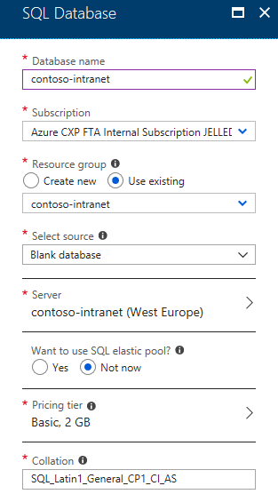

# POC Scenario: Modernize Intranet Web App Authentication 

## Table Of Contents

* [Introduction](#introduction)
  * [Abstract](#abstract)
  * [Learning Objectives](#learning-objectives)

* [Modernize Authentication](#modernize-authentication)
  * [Disable Windows Authentication](#disable-windows-authentication)
  * [Register the Azure Active Directory app](#register-the-azure-active-directory-app)
  * [Configure IIS to support HTTPS](#configure-iis-to-support-https)
  * [Update the Web App to use OpenID Connect](#update-the-web-app-to-use-openid-connect)
  * [Publish the Web App to Azure App Service](#publish-the-web-app-to-azure-app-service)
  * [Create an Azure SQL Database](#create-an-azure-sql-database)
* [Use Managed Service Identity (optional)](#use-managed-service-identity-optional)
  * [Configure a Managed Service Identity for the Web App](#configure-a-managed-service-identity-for-the-web-app)
  * [Update the Web App to use its Manage Service Identity](#update-the-web-app-to-use-its-manage-service-identity)
* [Inspect the OpenID Connect flow (optional)](#inspect-the-openid-connect-flow-optional)

## Introduction

#### Abstract

Modern authentication protocols allow you to decouple from Windows and Active Directory, instead allowing any person in the organization to sign in to a web application from any device - as long as it has internet connectivity.

During this guided Proof-Of-Concept (POC) scenario, you will modernize an existing intranet web application from being hosted on Windows with IIS and connecting to SQL Server all using Windows Integrated Authentication, into a cloud based web application using OpenID Connect to sign users in and a Managed Identity to securely connect to an Azure SQL Database.

#### Learning Objectives

* Understanding how to migrate an ASP.NET WebForms application from Windows Integrated Authentication to OpenID Connect using Azure Active Directory
* Using a Managed Identity to avoid having to manage and store credentials

#### Prerequisites

* Prior to completing this POC scenario please review the prerequisites found [here](preparation-modernize-intranet-webapp.md)


## Modernize Authentication

#### Disable Windows Authentication
> This allows modern authentication protocols to work without Windows accounts

  * Open IIS Manager, navigate to the `Contoso.Intranet.WebApp` application, open the `Authentication` settings, enable `Anonymous Authentication` and disable `Windows Authentication`
  * 

#### Register the Azure Active Directory app
> This lets Azure AD know that the web application will be requesting users to sign in

* In the Azure Portal under `Azure Active Directory`, open the `Properties` blade
* Copy the `Directory ID` into the `Web.config` file under the app settings key `Authority` and prefix it with `https://login.microsoftonline.com/`
  * E.g. `https://login.microsoftonline.com/afcb8d36-2e08-4142-908c-27eb5be24931`
* Alternatively, you can also use your full Azure AD tenant name instead of the Directory ID GUID
  * E.g. `https://login.microsoftonline.com/contoso.onmicrosoft.com`
* In the Azure Portal, under `Azure Active Directory`, open the `App registrations` blade and click `New application registration`
* Fill in the necessary details to register the web application
  * Name: `Contoso Intranet`
  * Sign-on URL: `https://localhost/Contoso.Intranet.WebApp/Default.aspx`

* In the `App registrations` blade, click `View all applications` to see the newly created app and click it to open the details
* Copy the `Application ID` into the `Web.config` file under the app settings key `ClientID`

#### Configure IIS to support HTTPS
> This is required because modern authentication protocols **require** the use of HTTPS for security purposes

* Open IIS Manager, right-click the root Web Site (e.g. `Default Web Site`) and select `Edit Bindings`
* Add a binding, set the `Type` to `https` and select the `IIS Express Development Certificate` as the SSL certificate
 

#### Update the Web App to use OpenID Connect
> OpenID Connect is the modern authentication mechanism for signing users into web applications

* Right-click the web project in Visual Studio, click `Properties`, go to the `Web` tab and set the `Start URL` property to `https://localhost/Contoso.Intranet.WebApp/Default.aspx`
  * This ensures that Visual Studio immediately navigates to the HTTPS version of the site when starting the application
* In the `Web.config` file, change `<authentication mode="Windows" />` to `<authentication mode="None" />`
  * This disables Windows Authentication for the web application
* Right-click the web project in Visual Studio, click `Manage NuGet Packages`, open the `Browse` tab, search for and install the `Microsoft.Owin.Security.OpenIdConnect`, `Microsoft.Owin.Security.Cookies` and `Microsoft.Owin.Host.SystemWeb` packages
  * This includes installing OWIN and the integration with ASP.NET on IIS
* Right-click the web project, under the `Add` menu select `New Item`, under the `Web` node select `OWIN Startup class` and rename the file to `Startup.cs`
  * This is the startup class that configures the OWIN middleware
* Copy the following code into the `Configuration` method and include the `using` statements at the top of the file:

```csharp
// using Microsoft.Owin;
// using Microsoft.Owin.Extensions;
// using Microsoft.Owin.Security;
// using Microsoft.Owin.Security.Cookies;
// using Microsoft.Owin.Security.OpenIdConnect;
// using Microsoft.IdentityModel.Tokens;
// using Owin;
// using System.Configuration;

app.SetDefaultSignInAsAuthenticationType(CookieAuthenticationDefaults.AuthenticationType);
app.UseCookieAuthentication(new CookieAuthenticationOptions());

app.UseOpenIdConnectAuthentication(
	new OpenIdConnectAuthenticationOptions
	{
		ClientId = ConfigurationManager.AppSettings["ClientId"],
		Authority = ConfigurationManager.AppSettings["Authority"],
		RedirectUri = ConfigurationManager.AppSettings["RedirectUri"],
		TokenValidationParameters = new TokenValidationParameters
		{
			NameClaimType = "name",
			RoleClaimType = "roles"
		}
	});

// This makes any middleware defined above this line run before the Authorization rule is applied in web.config
app.UseStageMarker(PipelineStage.Authenticate);
```

* Run the application from Visual Studio
* The browser will warn you about the security certificate used (because the `IIS Express Development Certificate` is not trusted); ignore that warning for now and continue to the website
* You should now be prompted to sign in to your Azure AD domain and provide consent so that the application is allowed to sign you in

* Once authentication and consent are done you will be redirected to the application and your user information should be displayed


#### Publish the Web App to Azure App Service
> This moves the web app out of the local IIS into Azure

* Use any of the supported ways to [deploy the project to Azure App Service](https://docs.microsoft.com/en-us/azure/app-service-web/web-sites-deploy)
  * Note that the easiest way if you are using Visual Studio is to [publish the project directly to Azure](https://docs.microsoft.com/en-us/azure/app-service-web/app-service-web-get-started-dotnet#publish-to-azure)
* When creating the App Service:
  * _Suggested name for the App Service: `<prefix>-intranet`_
  * _Suggested name for the App Service Plan: `<prefix>-intranet-asp`_
  * Ensure to create the App Service Plan in the Resource Group you created before
  * Ensure to create the App Service Plan in the same Azure region as the Resource Group
  
* After the deployment is complete, navigate to the Web App resource in the Azure Portal and on the `Overview` blade copy the URL to the clipboard (ensure that this is the HTTPS endpoint)
* Open the `Application settings` blade, and under the `Application settings` section, add a new setting named `RedirectUri` where the value is the HTTPS URL you just copied with `/Default.aspx` as the path
  * E.g. `https://contoso-intranet.azurewebsites.net/Default.aspx`
  * This will override the `localhost` setting in `Web.config` that was published along with the web application
* In the Azure Portal, navigate back to the `App registration` in Azure AD, click `Settings`, open the `Reply URLs` blade, add the same value as in the application settings (e.g. `https://contoso-intranet.azurewebsites.net/Default.aspx`) and save your changes
  * This configures Azure AD to also accept users signing in from the new URL
* Browse to the site at `https://<your-site-name>.azurewebsites.net/Default.aspx`
  * You will be prompted to sign in
  * After successful authentication with Azure AD, you will be redirected back to the Azure Web App
  * You will be able to see your user information (i.e. all the claims in the OpenID Connect `ID Token`), but the database information will now have an error as there is no LocalDB installed locally on the Azure Web App
 

#### Create an Azure SQL Database
> This sets up a new database to use for the web application

* In the Azure Portal, [create a new SQL Database](https://docs.microsoft.com/en-us/azure/sql-database/sql-database-get-started-portal)
  * Also create a new server and take care to note the admin login and password which we will use to connect from the web app
  
* Once the SQL Database is created, navigate to it in the Azure Portal, open the `Connection strings` blade and copy the ADO.NET connection string to the clipboard
* In the Azure Portal, navigate back to the `Application settings` blade of the web app, under `Connection strings` add a new connection string named `Default` where the value is the connection string you just copied
  * Make sure to replace the placeholders for the user name and password with the correct values
* Navigate back to the web application in the browser and note that now both the user and the database information should be displayed correctly


## Use Managed Service Identity (optional)

#### Configure a Managed Service Identity for the Web App
> This removes the need to maintain and store any credentials to access the database, instead using the identity of the App Service Web App itself to authenticate to Azure SQL Database

* In the Azure Portal, navigate to the Web App, on the `Managed service identity` blade set `Register with Azure Active Directory` to `On` and save your changes
* On the Web App's `Application settings` blade, edit the connection string and remove the `User ID` and `Password` parts so that there are no credentials anymore
* Open an [Azure CLI](https://docs.microsoft.com/en-us/cli/azure/install-azure-cli) locally or directly in the Azure Portal by using the [Cloud Shell](https://docs.microsoft.com/en-us/azure/cloud-shell/overview)
* Use the `az webapp identity show` command to get the `principalId` of the Managed Service Identity that was created for the web app, e.g.:

```
az webapp identity show --resource-group contoso-intranet-prod-rg --name contoso-intranet
```

* Grant permissions to the Azure SQL Database by using the `az sql server ad-admin create` command, e.g.

```
az sql server ad-admin create --resource-group contoso-intranet-prod-rg --server-name contoso-intranet --display-name webappmsi --object-id 8f5c09ea-afc8-47c5-b72f-a16f19a268cd
```


* Optionally, [grant minimal privileges](https://docs.microsoft.com/en-us/azure/app-service/app-service-web-tutorial-connect-msi#grant-minimal-privileges-to-identity) to the Managed Service Identity

#### Update the Web App to use its Manage Service Identity

* Right-click the web project in Visual Studio, click `Properties`, go to the `Application` tab and change the `Target framework` to `.NET Framework 4.6.2`
  * This is a prerequisite for the token-based authentication in the SQL connection
* Right-click the web project in Visual Studio, click `Manage NuGet Packages`, open the `Browse` tab, search for and install the `Microsoft.Azure.Services.AppAuthentication` package
  * This provides functionality to retrieve an access token for the Managed Service Identity
* Open the `Default.aspx.cs` file and right before the call to `sqlConnection.Open();`, add the line below:

```csharp
sqlConnection.AccessToken = (new Microsoft.Azure.Services.AppAuthentication.AzureServiceTokenProvider()).GetAccessTokenAsync("https://database.windows.net/").Result;
```

* Right-click the project in Visual Studio, click `Publish` and publish the application to Azure App Service again with the latest changes
* Navigate back to the web application in the browser and note that now both the user and the database information should still be displayed correctly, but there are no credentials stored inside code or configuration anymore


## Inspect the OpenID Connect flow (optional)

* Open an InPrivate/Incognito session in a web browser and enable the developer tools (e.g. using `F12`) and enable network capture
* Navigate back to the web application and follow the sign-in flow until you are back at the web application's home page
* Inspect the network requests and responses to follow the [OpenID Connect](https://docs.microsoft.com/en-us/azure/active-directory/develop/active-directory-protocols-openid-connect-code) protocol flow
  * The request to the web application should first be redirected to the `authorize` endpoint of Azure AD, e.g. `https://login.microsoftonline.com/bfcb8d36-2e08-4142-908c-27eb5be24938/oauth2/authorize?...`
  * At the end of the authentication flow, there should be an `HTTP POST` submitted to the web application containing the OpenID Connect `ID Token` and other authentication information.