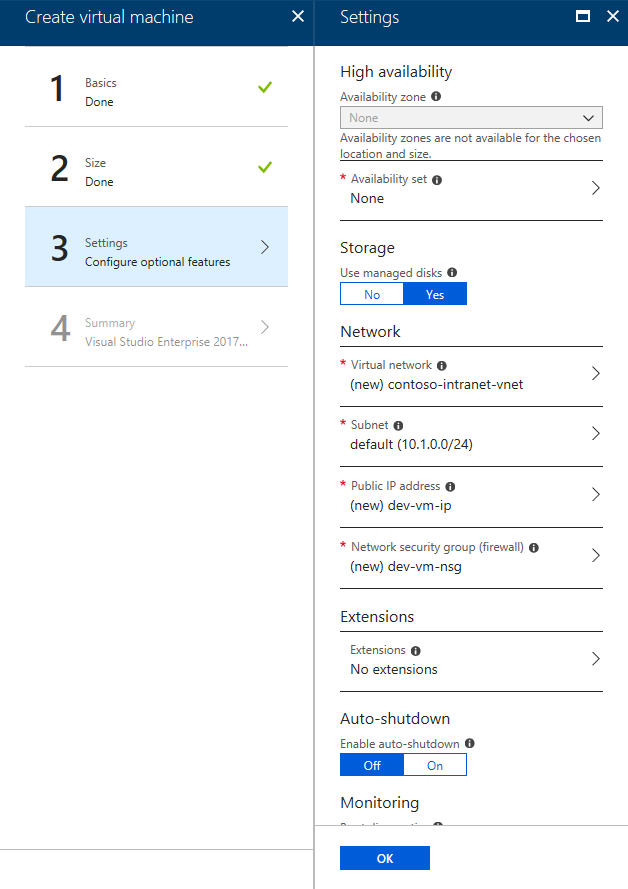
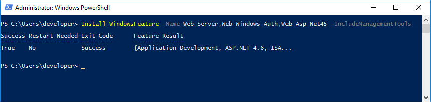

# POC Scenario: Modernize Intranet Web App Authentication - Prerequisites

## Table Of Contents
* [Introduction](#introduction)
  * [Abstract](#abstract)
  * [Learning Objectives](#learning-objectives)
* [Preparation](#preparation)
  * [Prerequisites](#prerequisites)
  * [Plan your deployment](#plan-your-deployment)
  * [Create a Resource Group](#create-a-resource-group)
  * [Create a development workstation (optional)](#create-a-development-workstation-optional)
  * [Open the application with Visual Studio](#open-the-application-with-visual-studio)
  * [Set up the Intranet Web App with Windows Integrated Authentication](#set-up-the-intranet-web-app-with-windows-integrated-authentication)


## Introduction

#### Abstract

Modern authentication protocols allow you to decouple from Windows and Active Directory, instead allowing any person in the organization to sign in to a web application from any device - as long as it has internet connectivity.

During this guided Proof-Of-Concept (POC) scenario, you will modernize an existing intranet web application from being hosted on Windows with IIS and connecting to SQL Server all using Windows Integrated Authentication, into a cloud based web application using OpenID Connect to sign users in and a Managed Identity to securely connect to an Azure SQL Database.

#### Learning Objectives

* Understanding how to migrate an ASP.NET WebForms application from Windows Integrated Authentication to OpenID Connect using Azure Active Directory
* Using a Managed Identity to avoid having to manage and store credentials

## Preparation

#### Prerequisites
To complete this scenario, you will need:
* An Azure subscription

#### Plan your deployment
* As part of this scenario, you will be deploying the following resources into a Resource Group:
  * Virtual Machine (optional)
  * App Service
  * SQL Database
* When choosing names for your resources, try to follow a **standard naming pattern**, e.g. by following the [naming conventions documented on the Azure Architecture Center](https://docs.microsoft.com/en-us/azure/architecture/best-practices/naming-conventions)
  * To make it easier, we'll provide suggestions based on a naming prefix of your choosing, referred to as `<prefix>` from this point onwards
  * To ensure that your deployment does not conflict with other Azure customers, use a prefix that is unique to your organization
  * To ensure that your chosen prefix can be used for all resource types, use a relatively short name consisting only of lowercase letters (no digits, no other special characters) e.g. `contoso`
* Choose an **Azure region** to host your deployment
  * You can choose any supported region, but for performance and cost reasons it's recommended to keep all resources in the same region whenever possible
  * You can see the availability of all [Azure services by region](https://azure.microsoft.com/en-us/regions/services/) to determine the best location

#### Create a Resource Group
> This allows you to group all the Azure resources you will use in a single container for easier management

* Navigate to the [Azure Portal](https://portal.azure.com) and sign in with your account
* [Create a Resource Group](https://docs.microsoft.com/en-us/azure/azure-resource-manager/resource-group-portal)
  * _Suggested name for the Resource Group: `<prefix>-intranet-prod-rg`_
  
#### Create a development workstation (optional)
> **Note:** If you already have a Windows machine with IIS and Visual Studio with .NET 4.6 or higher installed then you can skip this step and use that instead.

* In the Azure Portal, create a new Virtual Machine with Visual Studio
  * Create a new resource
  * Search the Marketplace for `Visual Studio Enterprise` and select the highest version available, e.g. `Visual Studio Enterprise 2017 on Windows Server 2016 (x64)`
  * Configure the basics, make sure you remember the username and password
  
  * Select a suitable VM size, e.g. `D2s_v3`
  
  * Configure the settings, make sure to deploy into a new Virtual Network so you don't interfere with other networks
  
* Once the machine is created, install IIS on it
  * First [connect to the Virtual Machine via Remote Desktop](https://docs.microsoft.com/en-us/azure/virtual-machines/windows/connect-logon)
  * Open PowerShell **as an administrator** and run the following command to install IIS and the necessary subcomponents:

```powershell
Install-WindowsFeature -Name Web-Server,Web-Windows-Auth,Web-Asp-Net45 -IncludeManagementTools
```



#### Open the application with Visual Studio

* Clone the repository or copy the project's [source code](../src/modernize-intranet-webapp) to a local working folder
* From the working folder, open **Contoso.Intranet.sln** with Visual Studio

#### Set up the Intranet Web App with Windows Integrated Authentication

* Run the web application from Visual Studio and notice that it is configured to use Windows Integrated Authentication (WIA) and a local SQL Express LocalDB as the database
  * The home page should show current user information (user name and Windows groups the user is member of) and database information (e.g. the connection string being used, some server properties and some properties showing the connected user)
  * In this case, the database login (`ORIGINAL_LOGIN`) should be the same as the local user because both IIS Express as LocalDB are running in the current Windows user's session
  * 
* Use IIS instead of IIS Express
  * Right-click the web project in Visual Studio, click `Properties`, go to the `Web` tab, under `Servers` switch from `IIS Express` to `Local IIS` and click `Create Virtual Directory`
  * This makes the web app run under the context of the local IIS service instead of the current Windows user's session
  * 
  * Open IIS Manager, navigate to the `Contoso.Intranet.WebApp` application, open the `Authentication` settings, disable `Anonymous Authentication` and enable `Windows Authentication`
   
  * Navigate back to the web application, it should now use another user as the database login representing the IIS Application Pool
  * 