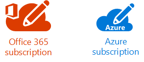
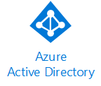
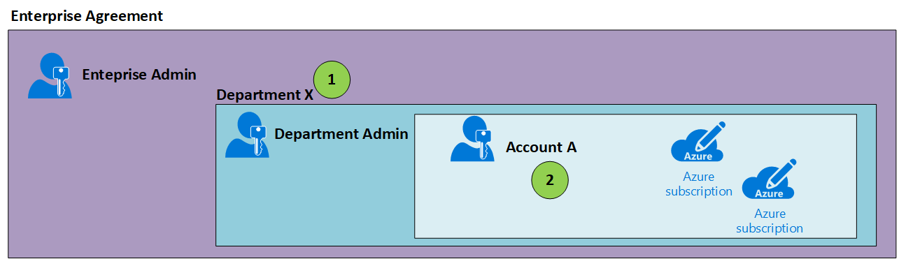
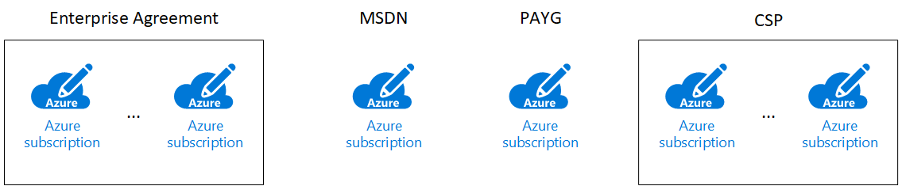
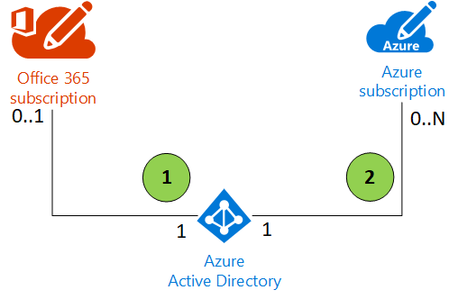
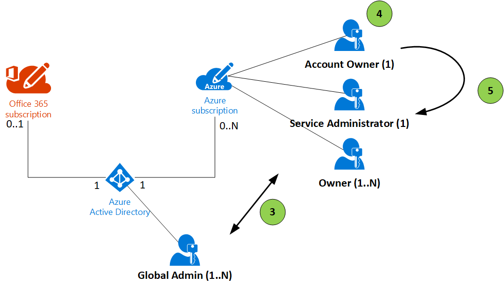

# Azure AD and the relation to Azure Subscriptions, O365 and Enterprise Agreement

## Definitions

### Subscription

*A subscription is an agreement with Microsoft to use one or more Microsoft cloud platforms or services, for which charges accrue based on either a per-user license fee or on cloud-based resource consumption*

For more information: [subscriptions](https://docs.microsoft.com/en-us/office365/enterprise/subscriptions-licenses-accounts-and-tenants-for-microsoft-cloud-offerings#subscriptions)

### Tenant

*An Azure AD tenant is a specific instance of Azure AD containing accounts and groups*

> NOTE: sometimes tenant is also used to denote an instance of a SAAS cloud offering: e.g. an O365 tenant or Dynamics 365 tenant. For the remainder of this article a tenant will be considered an instance of AAD.

For more information: [Tenants](https://docs.microsoft.com/en-us/office365/enterprise/subscriptions-licenses-accounts-and-tenants-for-microsoft-cloud-offerings#subscriptions)

### Enterprise Agreement

*Any Enterprise Agreement customer can add Azure to their agreement by making an upfront monetary commitment to Azure. That commitment is consumed throughout the year by using any combination of the wide variety of cloud services Azure offers from its global datacenters*

For more information: [Enterprise Agreement](https://azure.microsoft.com/en-us/pricing/enterprise-agreement/)

Breadcrumbs
1. The deparment level is optional
2. The **Account** is the user that will become the **Account Owner** of the subscription

### Subscription Types

There are different types of Azure subscriptions based on the type of contract that was used to acquire them.

## Relations with AAD

Breadcrumbs

1. Azure AD itself doesn't have to be linked to a O365 or Azure subscription. AAD can exist on its own. The other way around is not possible! O365 and Azure subscriptions are always linked to an AAD tenant.
2. Linking the Azure subscription to the AAD tenant is done at subscription creation. By default the Account Owners AAD tenant will be the one to which the subscription is linked to. If it's a Microsoft account  (e.g. john.doe@outlook.com) a new AAD tenant might be created (e.g. johndoeoutlook.onmicrosoft.com).

## Azure subscription Roles

Breadcrumbs

3. The Global Admin is a role that exist within AAD and has no privileges over Azure resources. The Account Owner, Service Administrator and Owners are roles that exist on a subscription and have no privileges over Azure AD.
4. Changing the Account Owner can potentially cause the subscription to be linked to another AAD tenant if the new Account Owner is from a different AAD tenant. It can also impact the billing in certain scenario's: e.g. it might cause the subscription to go from PAYG or MSDN to EA. Or to move between enrollments.
5. The Account Owner can change the Service Admin.

## EA Relation to AAD

The EA allows for different authentication methods to be defined. These determine whether none, one or multiple AAD tenants can be leveraged within the EA. An EA itself is not linked to a specific AAD Tenant.

When creating Enterprise Admins, Department Admins or Accounts the authentication level is always respected. 

EA Authentication levels:

* **Microsoft Account Only:** For organizations that chose to use, create and manage users through Microsoft accounts.
* **Work or School Account**: For organizations that have set up a single Azure Active Directory tenant.
* **Work or School Account Cross Tenant:** For organizations that have set up multiple Azure AD tenants.
* **Mixed Account:** Allows you to add users with Microsoft Account and/or with a Work or School Account.

## Special Notes

[Subscription to AAD relation](https://docs.microsoft.com/en-us/azure/active-directory/active-directory-how-subscriptions-associated-directory)

[Transfering subscriptions + advanced scenarios](https://kvaes.wordpress.com/2018/03/13/azure-subscription-management-beyond-the-101-aka-the-advanced-topics/)